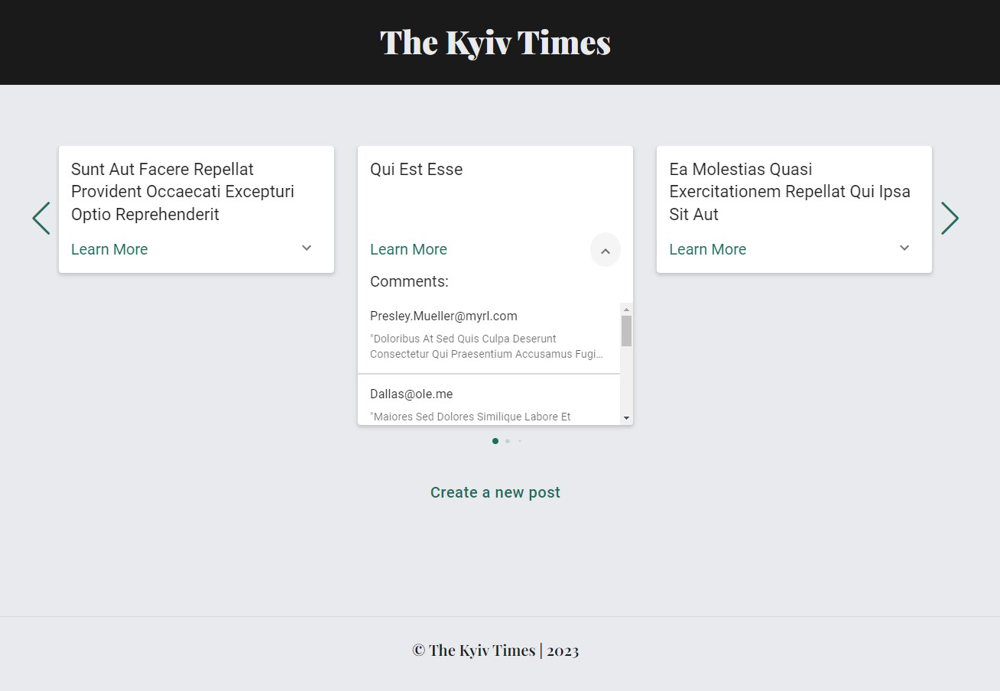
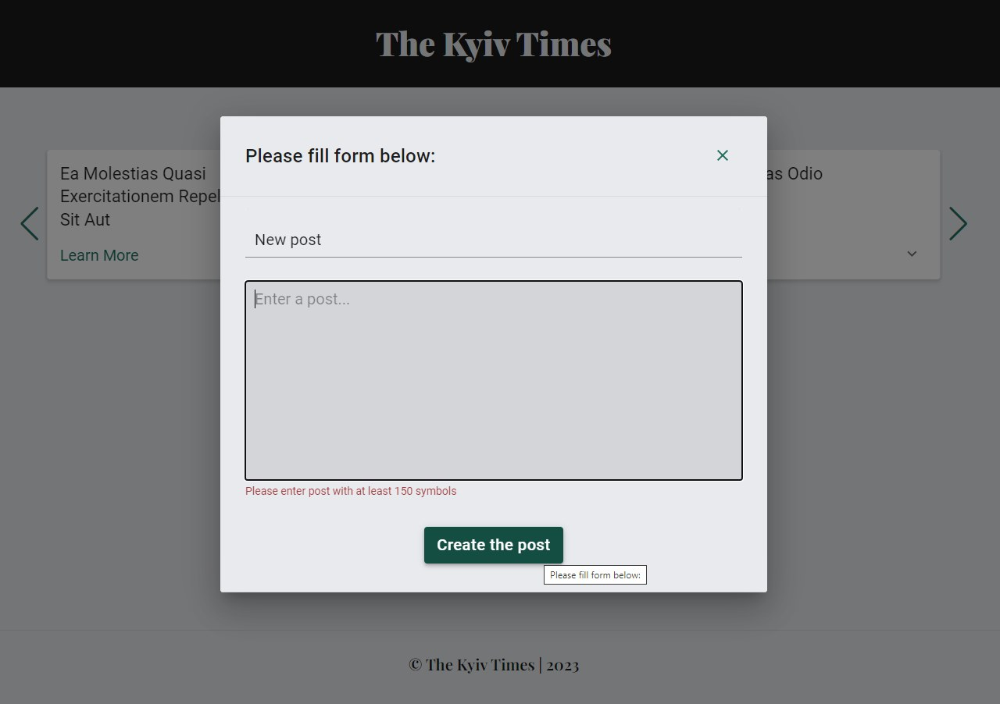
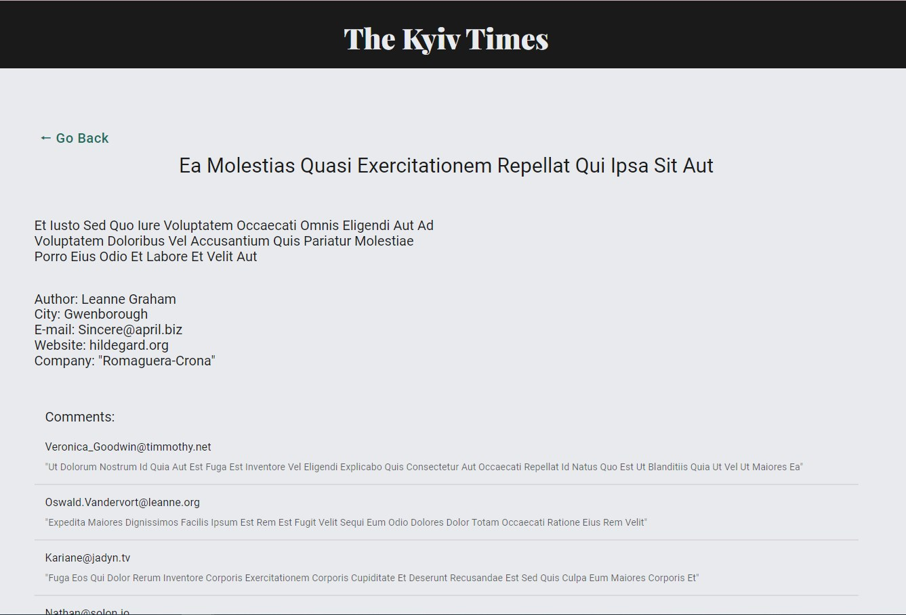
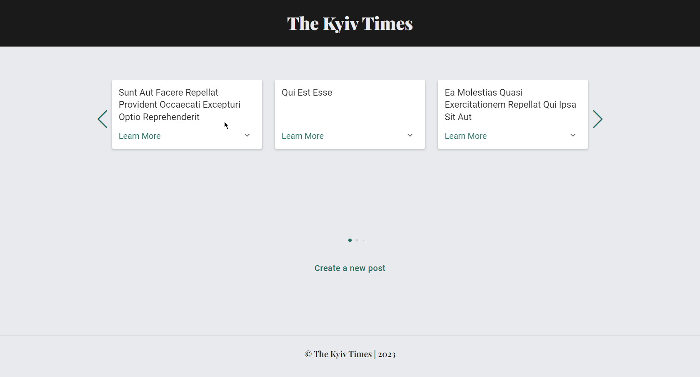

An app, that allows users to easily read and engage with posts in a carousel
format. Users can swipe through a carousel of posts and expand each post card to
view comments left by other users. Every post card can be expanded by clicking
the arrow at the right bottom angular. Then all comments leaved for this post
will be asynchroniously downloaded and user can see theirs.

Additionally, users can access the full post and view information about the
author by clicking on the "Learn More" button. There is all post and author
information, and also user can read all comments below at this page. Then user
can return to the home page by clicking to the "Go Back" button.

An addition, users can create their own post by clicking to the "Create a new
post" button. They'll see a modal window with form and validation, which can
allows them to fill info about new post.

Users can either view the app at its production link or run the app locally on
their computer.
[Production link](https://nadiakhoptiuk.github.io/the-kyiv-times/)

How to run locally:

1. Clone this repo to the computer;
2. Install all dependencies using a command "npm install";
3. Run the app using a command "npm start";
4. Please wait for the localhost to be automatically opened.

Some screenshots from the app:

Home Page: 

Modal window for creating new post:

Post Page: 

